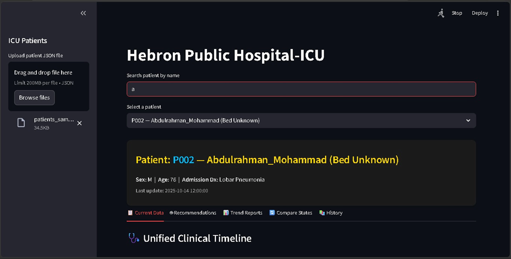
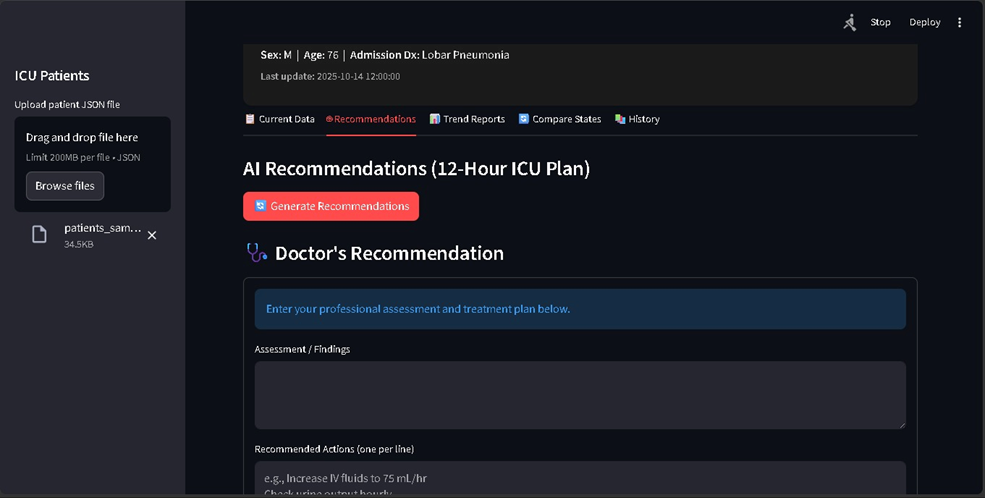
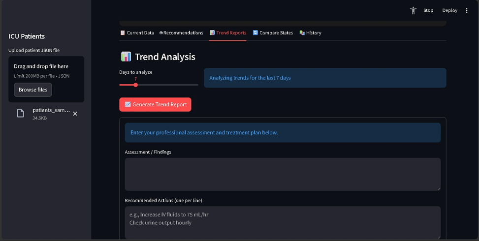
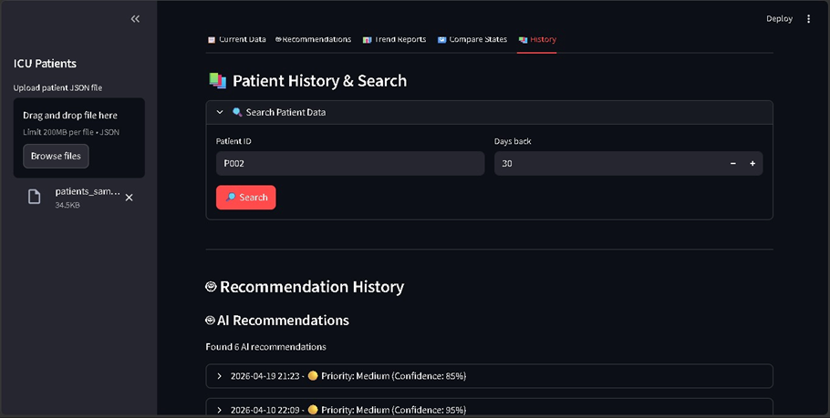

<div align="center">

# 🏥 Smart ICU

### AI-Powered ICU Clinical Decision-Support Prototype

Smart ICU is an AI-powered application designed to organize ICU patient data, analyze clinical trends, retrieve relevant historical cases, and generate structured recommendations while keeping physicians involved in the decision-making process.

</div>

---

## 📌 Overview

Smart ICU combines patient information, historical clinical data, AI-assisted recommendations, visualization, and physician input inside one interactive dashboard.

The application can process structured ICU data including:

* Vital signs
* Laboratory results
* Medications
* Imaging reports
* Clinical events
* Nursing notes
* Previous patient states
* Previous AI and physician recommendations

> ⚠️ **Disclaimer:** Smart ICU is an educational and experimental software prototype. It is not a certified medical device and must not be used as a substitute for professional medical judgment.

---

## 🚀 Features

### 👤 Patient Management

* Upload structured patient data using JSON
* Search patients by name
* View patient demographics and admission information
* Review vitals, labs, medications, imaging, events, and nursing notes

### 🩺 Unified Clinical Timeline

Smart ICU combines multiple clinical data types into a chronological timeline:

* Vital signs
* Laboratory results
* Imaging
* Clinical events

The timeline is displayed through interactive visualizations for easier review.

### 🤖 AI-Assisted Recommendations

The system can generate structured ICU recommendations based on:

* Current patient condition
* Previous patient history
* Previous physician recommendations
* Similar historical ICU cases

Generated output can include:

* Assessment
* Recommended actions
* Priority level
* Confidence score
* Supporting evidence
* Follow-up instructions
* Expected outcome
* Timeframe

### 🧠 Retrieval-Augmented Generation — RAG

Smart ICU retrieves semantically similar historical cases and uses them as additional context for AI recommendation generation.

```text
Current Patient Data
        │
        ▼
Patient History
        │
        ▼
Previous Doctor Recommendations
        │
        ▼
Similar Historical Cases
        │
        ▼
FAISS Semantic Retrieval
        │
        ▼
LLM Context
        │
        ▼
Structured AI Recommendation
```

### 🩺 Doctor-in-the-Loop

Physicians can manually enter and store:

* Clinical assessment
* Recommended actions
* Action type
* Priority
* Supporting evidence
* Follow-up instructions

AI-generated and physician-entered recommendations are stored separately for historical review.

### 📊 Trend Analysis

The application analyzes historical patient data across configurable time periods.

Available analysis includes:

* Vital-sign trends
* Laboratory trends
* Medication timelines
* Recommendation patterns
* Priority distributions
* Recommendation confidence

### 🔄 Patient State Comparison

Two historical patient states can be compared to identify:

* Vital-sign changes
* Laboratory changes
* Added medications
* Removed medications
* Continued medications

### 📚 Patient History

Smart ICU stores historical patient snapshots and recommendations.

Users can review:

* Previous patient uploads
* AI recommendation history
* Physician recommendation history
* Historical clinical states

---
## 📸 Screenshots

### 🏥 ICU Dashboard



### 🤖 AI Recommendations



### 📊 Trend Analysis



### 📚 Patient History



---

## 🏗️ Architecture

```text
                         ┌─────────────────────┐
                         │    Streamlit UI     │
                         └──────────┬──────────┘
                                    │
                                    ▼
                         ┌─────────────────────┐
                         │   Pydantic Models   │
                         └──────────┬──────────┘
                                    │
                     ┌──────────────┴──────────────┐
                     │                             │
                     ▼                             ▼
          ┌───────────────────┐         ┌───────────────────┐
          │      MongoDB      │         │    AI Pipeline    │
          │ Patient History   │         │ LangChain/OpenAI  │
          └─────────┬─────────┘         └─────────┬─────────┘
                    │                             │
                    ▼                             ▼
          ┌───────────────────┐         ┌───────────────────┐
          │ Historical Cases  │────────▶│  FAISS Retrieval  │
          └───────────────────┘         └─────────┬─────────┘
                                                 │
                                                 ▼
                                       ┌───────────────────┐
                                       │ AI Recommendation │
                                       └─────────┬─────────┘
                                                 │
                                                 ▼
                                       ┌───────────────────┐
                                       │ Physician Review  │
                                       └───────────────────┘
```

---

## 🛠️ Tech Stack

### Core


### AI & RAG


### Data & Visualization


---

## 📁 Project Structure

```text
Smart-ICU/
│
├── icu_local_ai/
│   ├── __init__.py
│   ├── icu_ai_cloud.py
│   ├── models.py
│   ├── sync_to_atlas.py
│   └── utils.py
│
├── scripts/
│   └── app_cloud.py
│
├── .gitignore
├── README.md
├── poetry.lock
├── pyproject.toml
└── requirements.txt
```

---

## ⚙️ Installation

### 1. Clone the repository

```bash
git clone https://github.com/Adham-Irzeqat/Smart-ICU.git
cd Smart-ICU
```

### 2. Install dependencies

Using Poetry:

```bash
poetry install
```

### 3. Configure Streamlit secrets

Create:

```text
.streamlit/secrets.toml
```

Configure the required credentials locally:

```toml
OPENAI_API_KEY = "your-key"
LANGCHAIN_API_KEY = "your-key"
LANGCHAIN_PROJECT = "Smart-ICU"
LANGCHAIN_TRACING_V2 = "true"
MONGO_URI = "your-mongodb-uri"
```

> Never commit `secrets.toml`, API keys, passwords, or database credentials to GitHub.

---

## ▶️ Run the Application

```bash
streamlit run scripts/app_cloud.py
```

Streamlit will display the local application URL in the terminal.

---

## 🔐 Privacy & Security

Because the project works with healthcare-related information:

* Use synthetic or properly de-identified patient data
* Never commit patient records to the repository
* Never expose personally identifiable health information
* Never commit API keys or database credentials
* Keep `.streamlit/secrets.toml` outside version control

---

## 🔮 Future Improvements

* Authentication and role-based access
* Improved clinical evidence retrieval
* Enhanced recommendation evaluation
* Automated testing
* Docker deployment
* Improved audit logging
* More advanced RAG retrieval
* Local/private LLM support
* FHIR-compatible healthcare data integration
* Improved security and access controls

---

## 👨‍💻 Author

**Adham Arzeqat**

Software Engineer | Full Stack Developer | AI Enthusiast

[](https://www.linkedin.com/in/adham-irzeqat-bbb007300)

---

<div align="center">

### Built as an exploration of AI-assisted clinical decision-support systems.

⭐ If you find the project interesting, consider starring the repository.

</div>
